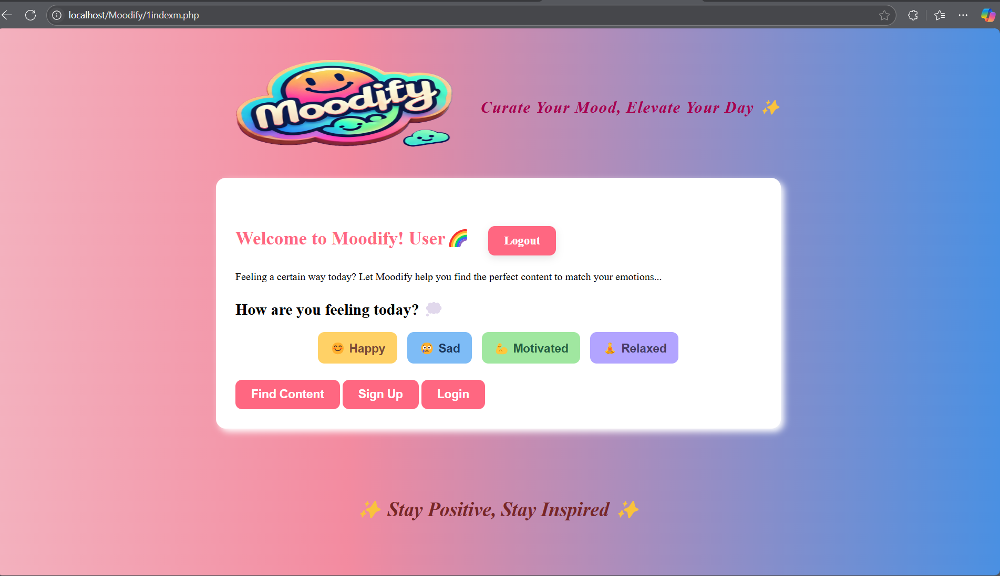

# 🎵 Moodify — Mood-Based Content Personalization Website

Welcome to **Moodify**—a web app designed to lift your spirits, relax your mind, and bring a smile to your day by curating content based on your mood! Whether you’re feeling happy, sad, motivated, or just want to unwind, Moodify picks the best quotes, activities, and music playlists just for you! 😄🎵

---

## ✨ Project Overview

Moodify is a full-stack web application blending fun frontend UI with powerful backend integration. It features:

- **Secure User Registration & Login** (PHP sessions, password hashing)  
- **Personalized Mood Selection** for customized experience  
- **Dynamic Content**—get motivational quotes, mood-based Spotify playlists, and daily activities  
- **Responsive UI** to look great on every device!

---

## 🧑‍💻 Technologies Used

- **Frontend:** HTML, CSS, JavaScript  
- **Backend:** PHP (session management, authentication)  
- **Database:** MySQL  
- **Stack:** XAMPP/WAMP (local server), phpMyAdmin

---

## 🚀 Features

- **Signup/Login:** Start your Moodify journey with secure registration & login!  
- **Mood Selection:** Choose from Happy, Sad, Motivated, or Relaxed. Moodify personalizes your dashboard instantly!  
- **Quote Carousel:** Swipe through uplifting and inspiring quotes tailored to your mood.  
- **Embedded Spotify Playlists:** Enjoy music that matches how you feel!  
- **Suggested Activities:** Get practical advice—watch movies, journal, exercise, or just chill.  
- **Session Management:** Stays secure while showing personalized greetings.  
- **Responsive Design:** Works perfectly on desktop *and* mobile.

---

## 📝 Demo Workflow

1. Register or Login to your account.  
2. Get greeted by name on the homepage.  
3. Select your mood.  
4. Browse personalized quotes, Spotify tracks, and suggested activities.  
5. Logout securely when done!

---
## 📷 Screenshots

-   
-   
-   
- 

---

## ⚡ Why Moodify?

Tech meets emotion! Moodify demonstrates:  
- Real-world backend development using PHP/MySQL  
- Secure session and authentication management  
- Practical use of personalized content delivery  
- Fun frontend integration with backend logic

Perfect for showcasing backend, database, and full-stack development skills for internships and placements!

---

## 🧑‍🎓 Author

**Ishita Kapoor**  
B.Sc Computer Science, VIT  
GitHub: [Ishita-kapoor](https://github.com/Ishita-kapoor)

---

## 📬 Want to Try It?

Fork this repo, clone, and run locally with XAMPP/WAMP. Set up the MySQL database with the included schema, and enjoy customizing your own Moodify experience!

---

## ⭐️ Give Moodify a Star!

If this project made you smile, or you found it useful for learning backend and web development, please star ⭐️ this repo!

